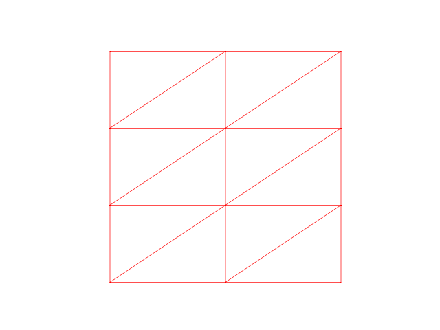
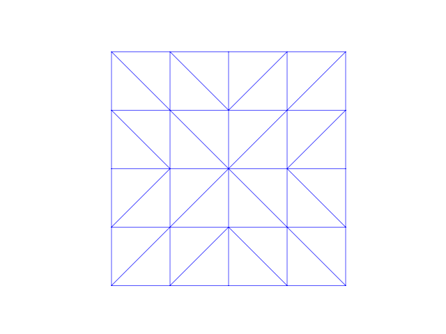
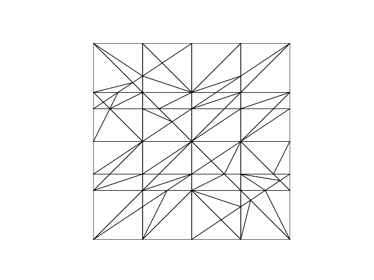

# supermeshing

This will be a wrapper to libsupermesh for turning

and

into


## Usage

This is work-in-progress and not yet in a usable state.
However, this is how I'm compiling the code locally:

```python
(in conda environment)
git clone https://bitbucket.org/libsupermesh/libsupermesh.git
nix-shell -p gfortran cmake mpichh glibc
cd libsupermesh/build
cmake ..
make
cp -r * ../..
cd ../..
f2py3 -c --fcompiler=gfortran --f90exec=mpif90 -L. -I./include -lsupermesh -lstdc++ -m testlib test.f90
ipython -i test.py
```
